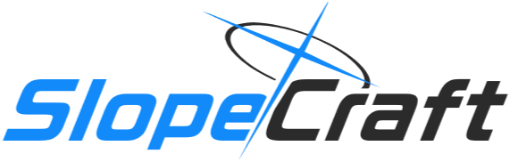

[中文](README.md) | **English** <!-- lang -->

  <b>Get your Minecraft pixel painting in multiple kinds of forms!</b>

    
    
    
     
    
    
    

## 📖 Introduction

SlopeCraft is created using Qt + Eigen + zlib for creating 3D pixel map arts within Minecraft.

The difference between this program and SpriteCraft is that this program focuses on pixel art on maps. Its purpose is to
record the pixel art with the map, then display it in an item frame (the map here refers to the in-game item, and not
the saving files).

The color modification module is targeted towards the map. The pixel art is meant to resemble the art in the "point of
view" of the map - not of the player.

Since the color within the map is related to the relative height of the block, the pixel art created by SlopeCraft is
usually in 3D, which I call 3D Pixel Art.

In summary, SlopeCraft is created for map pixel art.

This is why maps made by SlopeCraft have higher quality than exporting a picture from SpriteCraft then recording it with
a map - because SlopeCraft is specifically designed for map pixel art.

## ⚙️ Installation

1. Download the latest version of SlopeCraft from
   the [Release](https://github.com/SlopeCraft/SlopeCraft/releases/latest) page.

2. Run SlopeCraft
    - Windows Users: Download `SlopeCraft-x.x.x-win.zip`, unzip and run `SlopeCraft.exe`
    - macOS Users: Download `SlopeCraft-x.x.x-mac.zip`, unzip and drag `SlopeCraft.app` into the Applications folder and
      run `SlopeCraft`
    - Linux Users: Download `SlopeCraft-x.x.x-linux.tar.xz`, unzip and run `SlopeCraft`

   ::: tips
   The `x.x.x` mentioned above is the version number of SlopeCraft, for example, `5.0.0`.

3. Make sure you have read the [FAQ](https://slopecraft.readthedocs.io/en/faq/) and the tutorial before doing anything.

## 🗃️ Related Documentations

### FAQ

- [FAQ](https://slopecraft.readthedocs.io/en/faq/)

### Tutorials

- [SlopeCraft Tutorial](https://slopecraft.readthedocs.io/en/SlopeCraft-tutorial/)
- [VisualCraft Tutorial](https://slopecraft.readthedocs.io/en/VisualCraft-tutorial/)

### Introduction to Principles

- [Principal of Map Pixel Art](https://slopecraft.readthedocs.io/en/principles-introduction/)

### Compilation Guide

- If you want to compile SlopeCraft yourself, you can refer to
  the [Compilation Guide](https://slopecraft.readthedocs.io/en/compilation-guide/) for operation.

## 🛠️ Other Related Repositories

* [NBTWriter](https://github.com/ToKiNoBug/NBTWriter-of-Toki) - Lib for writing NBT files.
* [SlopeCraftTutorial](https://github.com/ToKiNoBug/SlopeCraftTutorial) - Tutorials
* [SlopeCraftCompressLib](https://github.com/ToKiNoBug/SlopeCraftCompressLib) - Lib for building height map and lossless
  compression lib.
* [SlopeCraftLossyCompression](https://github.com/ToKiNoBug/SlopeCraftLossyCompression) - Lossy compression lib, based
  on SlopeCraftCompressLib.
* [SlopeCraftGlassBuilder](https://github.com/ToKiNoBug/SlopeCraftGlassBuilder) - Glass bridge building lib.
* [HeuristicFlow](https://github.com/TokiNoBug/HeuristicFlow) - GA implementation.
