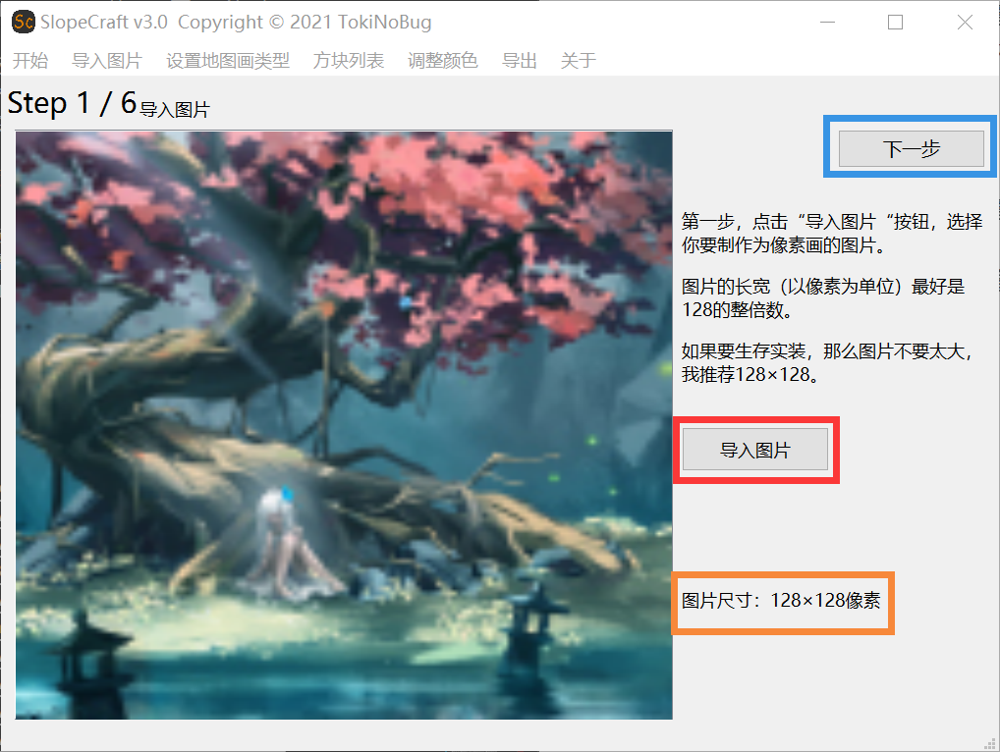
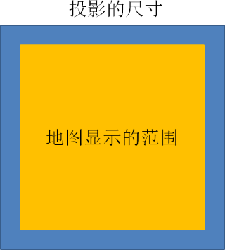
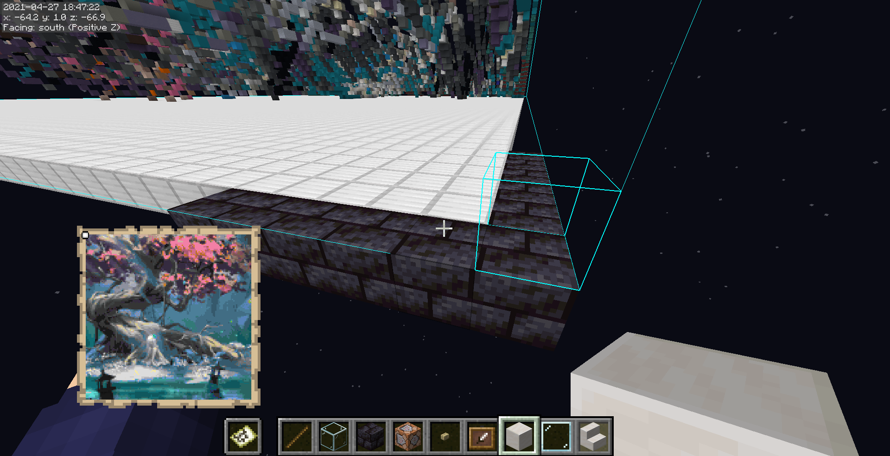

# SlopeCraft v3.0傻瓜式教程

手把手教你生成立体地图画

**我是SlopeCraft的开发者TokiNoBug**。在SlopeCraft v3.0发布之后，有很多人问了各种各样的问题，我深感立体地图画比较复杂，有些注意事项必须写一个文档来说明。

这个文档将会尽量详细的告诉你如何使用SlopeCraft。

欢迎访问[我的b站主页https://space.bilibili.com/351429231](https://space.bilibili.com/351429231)
   
   

   欢迎的**关注**+**点赞投币收藏素质三连**~

## 第1步 导入图片并设置地图画的属性

1. 双击启动SlopeCraft.exe，你将会看到如下的界面。
   
   

2. 这里需要你选择**地图画的类别**：
    - 如果你想要**颜色尽量丰富**、**画质尽量精致**的地图画，最好点击左侧的**创建立体地图画**按钮。
    - 如果你想要传统的平板地图画，不太在意地图画的画质，那么请点击中间的**创建平板地图画**按钮。
    - 第三种地图画还没有实现，请等待后续的更新。

    这里我选择了立体地图画。

3. 预处理图片：

   选好你要生成的图片，用ps或者其他可以编辑图片的软件，**将它的长宽缩放到128像素的整倍数（可选）**。

   这里我将图片调整到128×128像素，这也恰好是单张地图的大小。

   

   将这张图片保存好。

4. 导入图片：

   切回SlopeCraft，点击红框中的**导入图片**按钮，在弹出的文件选择框中找到刚刚调整好的图片。看一下下面橙色框中显示的**图片尺寸**，确认自己没有选错图片。

   如果没有bug，那么这张图片会在左侧显示出来。

   

   导入图片成功后，蓝框中的**下一步**将会亮起，代表你可以继续到下一步，点击这个按钮。

   **前往下一步的按钮固定在右上角，以后的图片中不会再特别标出。**

5. 确认地图画的类型

   在这一页，你需要设置地图画对应的**游戏版本**。

   在蓝框中选好游戏版本。这里我只支持1.12~ 1.16，未来还会支持1.17。

   需要注意，1.12~1.15版本的地图画的“画质”没有区别，平板地图画有**51色**，立体地图有**153色**。1.16为阴间树增加了7种基础颜色，所以平板地图画可以使用**58色**，立体地图画则可以使用**174色**。

   _Mj为啥要给阴间树这么多颜色？多来点肉色不好吗？_

   虽然你已经在最开始的页面中设置了地图画的类型，但仍然可以在这里重新选择地图画类别。请注意，**不要选择“不可实装的地图画”**，我还没有写完导出这种地图画的代码。

   

   完成这些设置后，点击红框中的确认按钮。接下来**绿框中会显示这个地图画的信息，让你再次确认。**确认无误后点击下一步。

## 第2步 配置方块列表

方块列表其实就是一个地图画的“**材料表**”，或者“**调色盘**”。**它决定了地图画的调色盘中一共有哪些颜色，每种颜色又对应哪种方块。**

这个页面比较复杂，我将依次介绍每个部分。**（其实一般来说，方块列表都不太需要自己调整）**

1. 滑动区内显示了每一种基础颜色。在**蓝框**中，你可以勾选**是否允许SlopeCraft使用这种颜色**。默认情况下，每种基础颜色都会被勾选（1.16中新增的颜色在更低版本除外）
   
2. 橙色框中是**每一种颜色所对应的方块**。调色盘中的每一种颜色都只能使用一种方块。

   你可能认为图中很多方块的颜色不同，但请注意，**它们在“地图的眼睛”里是完全相同的**，选择的唯一依据就是方块是否容易量产。

   有些基础颜色只有一种方块可用，然而调色盘不能空缺，所以这个选项是不可更改的，就像图中的玻璃，它必须被选中。

3. 左上角有四种预设的方块列表可供选择：

   - Vanilla是“**原汁原味**”的，尽量使用每种颜色“原先的方块”。它比较适合创造模式，不适合生存实装（废话，一堆钻石块爽死你）
   - Cheap极力选择**最便宜的方块**，保证每种方块都是可以量产的。它适合生存前期。
   - Elegant是在可以生存实装的情况下，尽量选择“**最优雅的方块**”，比如尽量选择小黑偷不走的、既好看又不太难量产的方块。这是默认的选项。
   - Shiny**专为光影而生**，它尽量选择发光的方块，力求在光影中足够绚丽。
   - Custom则代表你使用了**自定义**的方块列表。
  
4. 左下角的浅绿框内的按钮方便批量操作，意思很明显，不再多解释。
   
完成这些设置之后，点击红框中的确认。**在“下一步”按钮的左侧，会显示这张地图画可以使用多少种颜色。**

默认情况下，1.12~1.15版本中的立体地图画可以使用51种颜色，立体地图画则有153种；1.16的平板地图画可以使用58种颜色，立体地图画则有174种。如果你禁用了某些基础颜色，那么这个数量会减少一些。 **所以调色盘越丰富，画质就越好。** 至于怎么在画质与实装难度之间权衡，It's up to you.

点击确认后，前往下一步。

## 第3步 调整图片颜色（将图像转化为地图画）

经过前面的步骤，我们导入了一张图片，并确认好了这个地图画的“调色盘”都拥有哪些颜色。完成这些前置后，我们就该进入正餐了：将图像转化为地图画。

如下图所示，**橙框中的按钮会将图像的颜色调整为地图画的调色盘中可以使用的颜色**，而青色框中的两个按钮也很好理解，它们可以让原图或调整后的地图画显示出来，方便你做对比。

那么，上面的蓝框是什么呢？你不需要学习颜色空间的知识，只需要知道**这五个选项代表五种调整颜色的方式。**
对于同一张图像，这五种调整方式的效果都是不同的。

我们都希望地图画与原图尽量接近，所以你可以依次试一下每一种调整方式，通过青色框中的两个按钮来回比较，选出调整效果最好的一种。

调整图片的过程可能会比较慢，尤其是对于比较大的图片。
**如果进度条突然停滞不前，甚至窗口未响应，请不要关闭窗口，什么都不用做，耐心等待即可。**
调整图片的过程有大量的计算任务，我的技术水平又相当有限，卡顿是正常的。

在选出了你认为最好看的地图画之后，请点击右上角的**导出为投影**，进入生成地图画的最后一步。

## 第4步 导出为投影

后缀名为.litematic的投影文件是投影mod用来存储方块结构的文件。由于投影mod被广泛使用，我决定赋予SlopeCraft导出为投影的功能——**毕竟，这个软件是为生存实装而设计的**。

如果你不需要生存实装，只想得到map_0.dat这样的纯文件地图画，那这一步可能会让你失望了：这个功能确实还没有完成。不过它没有什么技术难度，**相信我，这个功能会在不久的将来加入的**。

进入这个页面后，你可以在橙色的三个输入框中确认投影文件的名称、作者和区域名称。**请注意，投影区域名称最好不要包含任何汉字，最好只用英文书写，否则投影文件很可能会因为汉字乱码而无法读取。**
不过呢，另外两个输入框并不受这个限制，哪怕汉字乱码，投影文件的格式也不会损坏。
这三项不是必选的，**你完全可以忽略这三个输入框**。

接下来，请点击红框中的**构建三维结构**按钮。
进度条走完后，在蓝框中会显示出投影的尺寸和总方块数量。如果你的原图比较大（超过256×256像素），而你的欧气又不是太好的话，那么投影尺寸中的Y有可能会超过256，**这意味着你的立体地图画超过了限高，不可能实装。**

如果遇到这种情况，有几种方法可能会解决问题：
   - 缩小图片的尺寸
   - 退回到上一步，换一种颜色空间，重新生成地图画
   - 将原图向左或向右旋转90°，重复生成地图画
   - 适当调整图片的色相或饱和度等，重复生成地图画
   - 换一张图片
   - 都不行的话，洗洗睡吧

在这个例子中，图片的尺寸只有128×128，所以必然不会遇到这种情况。然后就是最后一步了：导出。

点击红框中的**导出**按钮，选好投影文件的路径，等到进度条走满。然后，点击右上角的**结束**，你会来到这个界面。

红框中的按钮会在文件资源管理器中帮你显示导出的文件，如果你不小心把投影导出在了奇奇怪怪的位置，它能帮你找到投影文件。

右边的退出按钮不用解释了吧。

## 投影导出好了，要怎么使用呢？

你不会真的以为到这里就结束了吧？导出完投影之后，还有一些需要注意的事情。

1. 为什么我的投影尺寸比地图大一圈？
   
   我很喜欢Mojang的两句话：*It's a FEATURE*，以及 *Work as intended*。这确实是底层特性。

   如果你的图片尺寸是**128×128像素**，那么导出的投影的尺寸应该是**130×y×130**。一张**地图的分辨率恰好也是128×128**，这就是为什么我建议你把图片缩放为128像素的整倍数。

   下面的这个示意图应该能说明这个投影要怎么放置：

   

   投影在东西南北四个方向上恰好比地图范围宽一格，地图的显示范围应当居中。

   如果这不够明确，还可以看一看这张截图：

   

   图中铁块的部分是地图所显示的范围，浅蓝色细线则是投影的轮廓。

2. 为什么会有这些石头？
   
   

   答：这是个特性。虽然这些石头并不是地图画的内容，但它们仍然是立体地图画不可缺少的一部分。

   立体地图画之所以能拥有3倍于平板地图画的颜色，就是因为它充分利用了地图记录地形的机制：**方块之间的相对高度会调整它们在地图上的亮度。** 在地图画的内部，每个方块同时有两个任务：
   1. 显示自己的颜色
   2. 调整自己南边方块的亮度。

   然而，对于地图画最北侧的方块来说，它们处在地图画的边界，它们的亮度也需要调节。所以我加入了这些石头，**它们不处在地图画的显示范围内，却仍然影响地图画的内容**。

   当然，如果你执意把它们去掉，影响也不大。

## 写在最后

应该没什么还需要注意的了吧？

我有可能懒得发视频介绍这个软件，如果有问题，可以在 b站 或者 Github 联系我。

如果你发现了一个 bug，或者认为有 bug，在联系我的时候请附上：
- 出错页面的截图
- 你使用的原图
- 导出的投影文件（如果有的话）
- 详细的操作流程
  
没有这些，我很难排查出 bug。

TokiNoBug

2021.4.27
