# SlopeCraft v3.1使用教程

**我是SlopeCraft的开发者TokiNoBug**。立体地图画的详细使用方法已经在上一个教程中详述。

本来我不打算再次重复这部分，但鉴于这份教程将会有中英双语两个版本，而前一份教程并没有英文版，我还是会简单介绍立体地图画的创建方法。

这个文档将会告诉你如何使用SlopeCraft创建立体、平板和纯文件地图画。

SlopeCraft v3.1加入了对英文的支持，如下图所示。

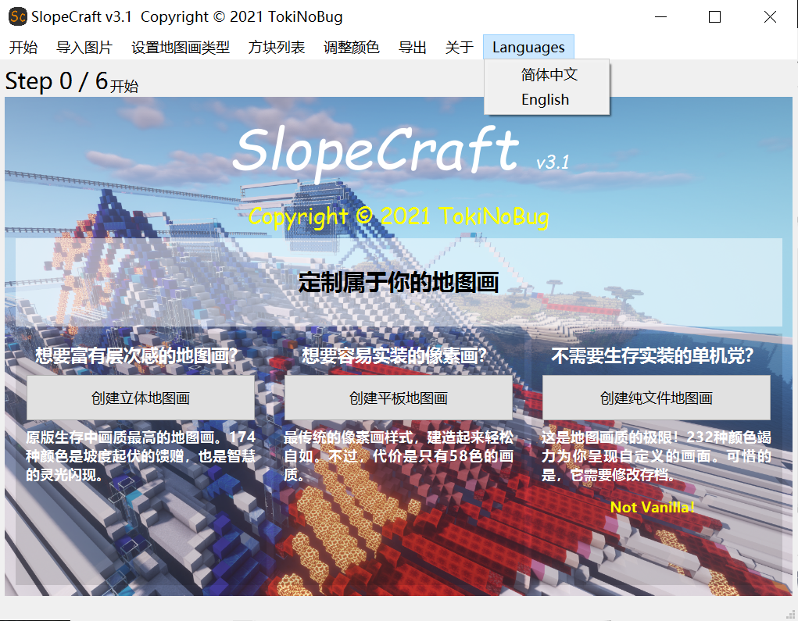

在菜单栏的Languages下拉菜单中你可以找到切换语言的选项。

## 第1步 图片预处理

1. 首先，准备好你想要制作成地图画的源图片，比如这张

   

2. 用ps或者其他可以编辑图片的软件，**将它的长宽缩放到128像素的整倍数**。

   这里我将图片缩放到256×256像素，这恰好是2×2地图的大小。

   

   （其实不调大小也无所谓）

3. 将这张图片保存好。

## 第2步 将图片转换为地图画

一般的图片支持256×256×256色，但在Minecraft中，地图仅支持不到256种颜色，我们实际能使用的颜色还要再打折扣。所以必须要将图片的每一个像素都转化为地图画中拥有的颜色。

1. 下载并启动SlopeCraft

   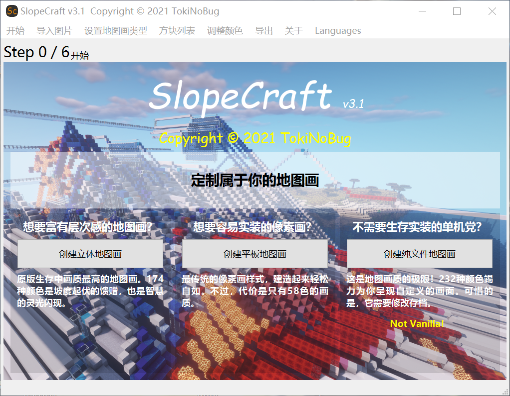

   - 如果你想创建立体地图画，请点击左侧的**创建立体地图画**按钮；
   - 如果你想创建平板地图画，请点击中间的**创建平板地图画**按钮；
   - 如果你不需要让地图画在游戏中以方块的形式存在，只需要让它显示与地图中，并能被贴在物品展示框中，那么请点击右侧的**创建纯文件地图画**按钮。

   请注意，这种纯文件地图画在使用时至少需要替换存档中的文件，有可能还需要使用命令。一般只适用于单机游戏，如果你是服务器管理员也可以。

2. 导入图片

   完成上述操作后将自动跳转到下一页面。

   点击**导入图片**按钮，选中刚刚预处理的图片，将其导入到SlopeCraft中

   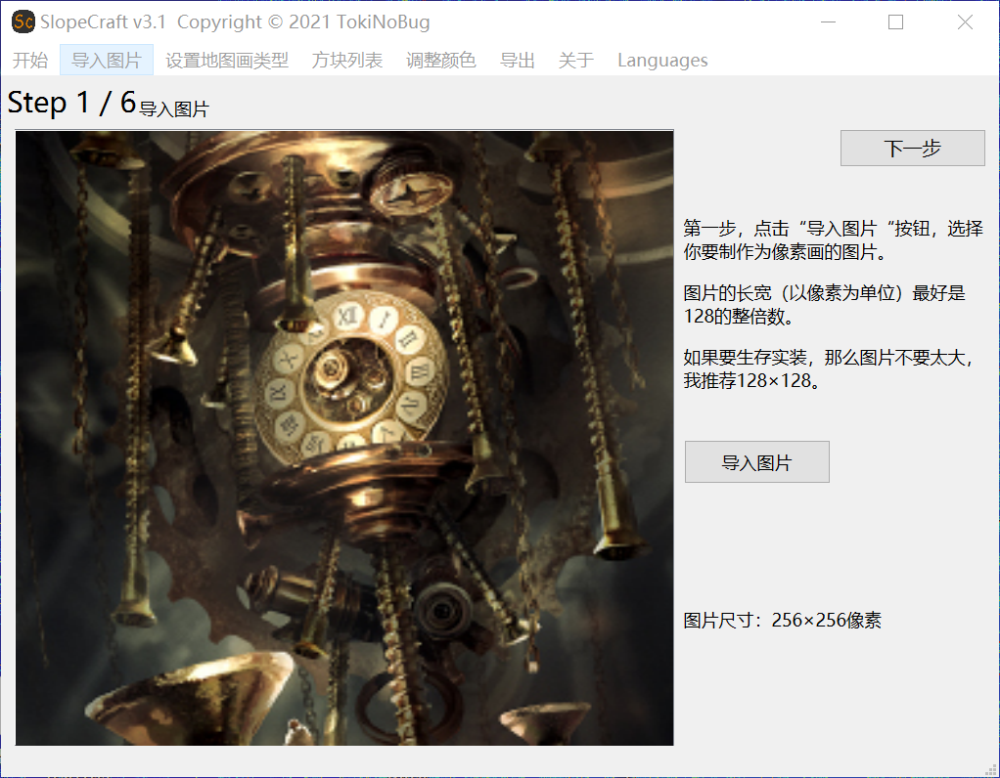

   点击右上角的下一步，继续。

3. 选择**地图画的类别**

   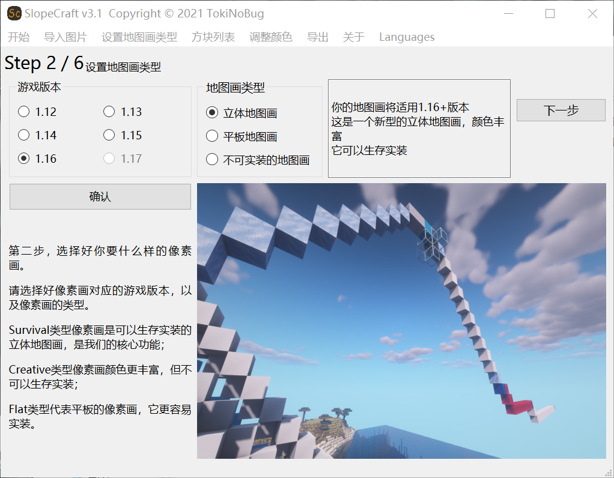

   首先，选择好Minecraft的游戏版本。这里我只支持1.12~ 1.16，未来还会支持1.17。

   需要注意，1.12~1.15版本的地图画的“画质”没有区别，平板地图画有**51色**，立体地图有**153色**。1.16为阴间树增加了7种基础颜色，所以平板地图画可以使用**58色**，立体地图画则可以使用**174色**。
   
   虽然你已经在最开始的页面中设置了地图画的类型，但仍然可以在这里重新选择地图画类别。这会覆盖你在第一页界面中的选择。一般什么都不做就行。

   然后，点击**确认**按钮，图片上面的框中会显示你将要创建的地图画的详细情况。

   完成这些后，点击**下一步**。

4. 配置方块列表

   方块列表其实就是一个地图画的“**材料表**”，或者“**调色盘**”。**它决定了地图画的调色盘中一共有哪些颜色，每种颜色又对应哪种方块。** 
   这个页面比较复杂，我将依次介绍每个部分。**（其实一般来说，方块列表都不太需要自己调整）**

   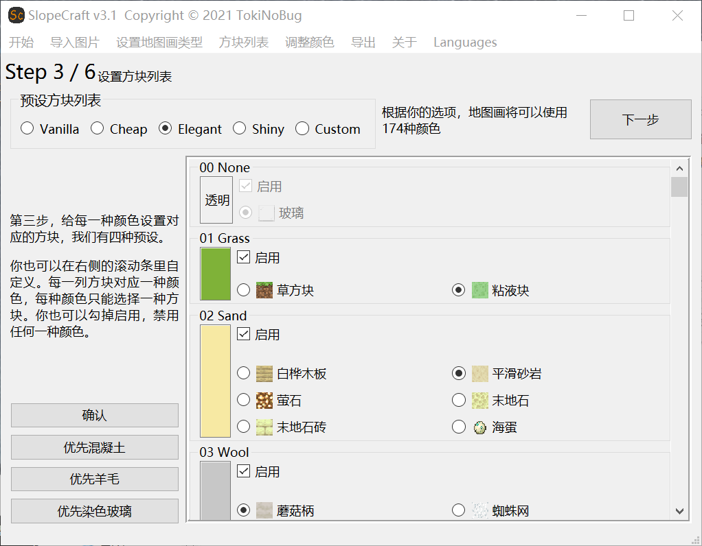

   1. 滑动区内显示了每一种基础颜色。在**启用**框中，你可以勾选**是否允许SlopeCraft使用这种颜色**。默认情况下，每种基础颜色都会被勾选（1.16中新增的颜色在更低版本除外）

   2. 启用框的下方是**每一种颜色所对应的方块**。调色盘中的每一种颜色都只能使用一种方块。

      - 你可能认为图中很多方块的颜色不同，但请注意，**它们在“地图的眼睛”里是完全相同的**，选择的唯一依据就是方块是否容易量产。
        
      - 有些基础颜色只有一种方块可用，然而调色盘不能空缺，所以这个选项是不可更改的，就像图中的玻璃或绿宝石块，它必须被选中。

   3. 左上角有四种预设的方块列表可供选择：

      - Vanilla是“**原汁原味**”的，尽量使用每种颜色“原先的方块”。它比较适合创造模式，不适合生存实装（废话，一堆钻石块爽死你）

      - Cheap极力选择**最便宜的方块**，保证每种方块都是可以量产的。它适合生存前期。

      - Elegant是在可以生存实装的情况下，尽量选择“**最优雅的方块**”，比如尽量选择小黑偷不走的、既好看又不太难量产的方块。这是默认的选项。

      - Shiny**专为光影而生**，它尽量选择发光的方块，力求在光影中足够绚丽。

      - Custom则代表你使用了**自定义**的方块列表。
  
      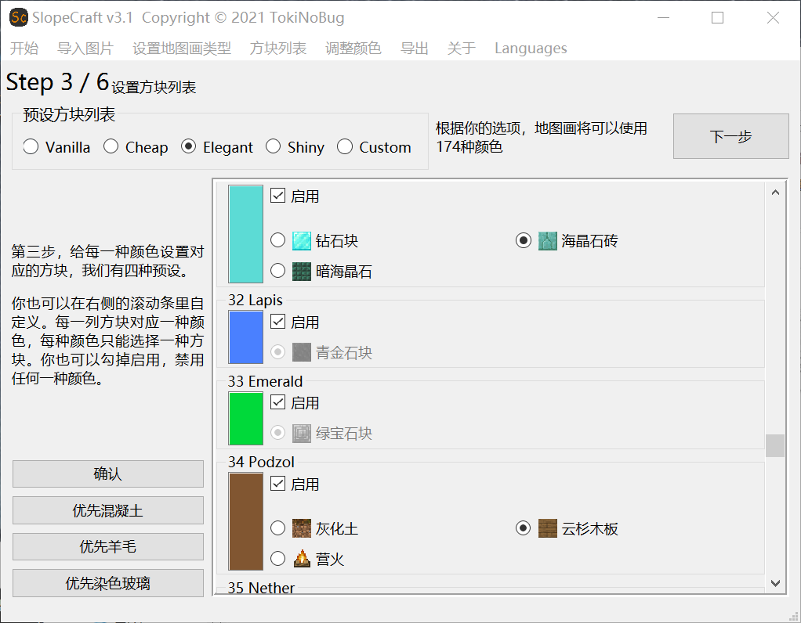

   4. 左下角的**优先使用混凝土**等按钮方便批量操作，意思很明显，不再多解释。

   完成这些设置之后，点击确认。**在“下一步”按钮的左侧，会显示这张地图画可以使用多少种颜色。**

    默认情况下，1.12~1.15版本中的平板地图画可以使用51种颜色，立体地图画则有153种；1.16的平板地图画可以使用58种颜色，立体地图画则有174种。如果你禁用了某些基础颜色，那么这个数量会减少一些。**所以调色盘越丰富，地图画尺寸越大，画质就越好。**
    至于怎么在画质与实装难度之间权衡，It's up to you.

    点击确认后，前往下一步。

5. 调整颜色

   完成上述前置工作后，我们该进入正餐了：将图像转化为地图画。

   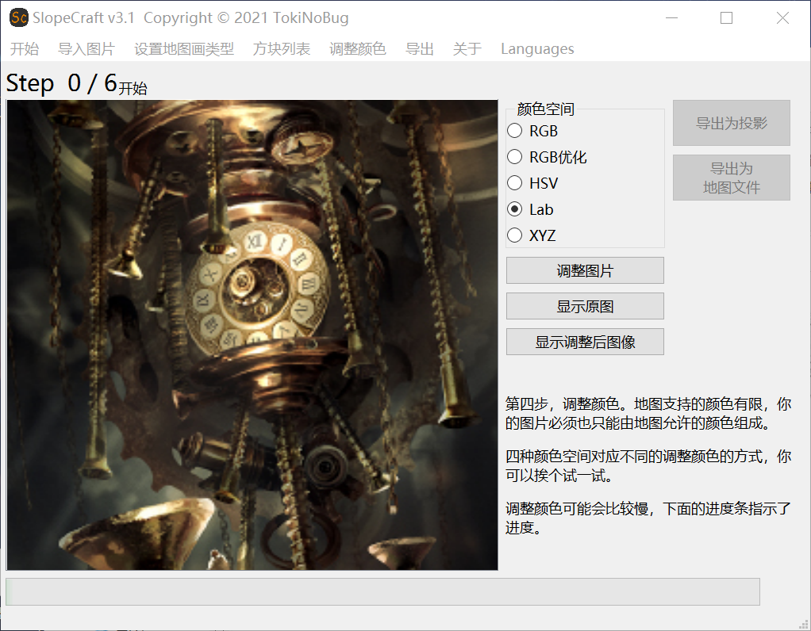

   **调整图片**按钮会将图像的颜色调整为地图画的调色盘中可以使用的颜色，而下面的**显示原图**和**显示调整后图像**分别显示原图和调整后的地图画，方便你对比。

   上面的颜色空间有五种选项，**这五个选项代表五种调整颜色的方式。**
   对于同一张图像，这五种调整方式的效果都是不同的。

   我们都希望地图画与原图尽量接近，所以你可以依次试一下每一种调整方式，通过两个按钮来回比较，选出调整效果最好的一种。

   调整图片的过程可能会比较慢，尤其是对于比较大的图片。
   **如果进度条突然停滞不前，甚至窗口未响应，请不要关闭窗口，什么都不用做，耐心等待即可。**
   调整图片的过程有大量的计算任务，我的技术水平又相当有限，卡顿是正常的。

   在选出了你认为最好看的地图画之后，就要进入生成地图画的最后一步了：**导出**。

## 第3步 导出

   导出有两种类型：导出为投影和导出为地图文件。对于不同类型的地图画，应当选择不同类型的导出方式：

   - 立体地图画：导出为投影
   - 平板地图画：导出为投影
   - 纯文件地图画：导出为地图文件。

（其实立体和平板也不是不能导出为地图文件，但缺乏意义）

### 导出为投影

1. 在调整颜色完成之后，**导出为投影**的按钮亮起。
   
   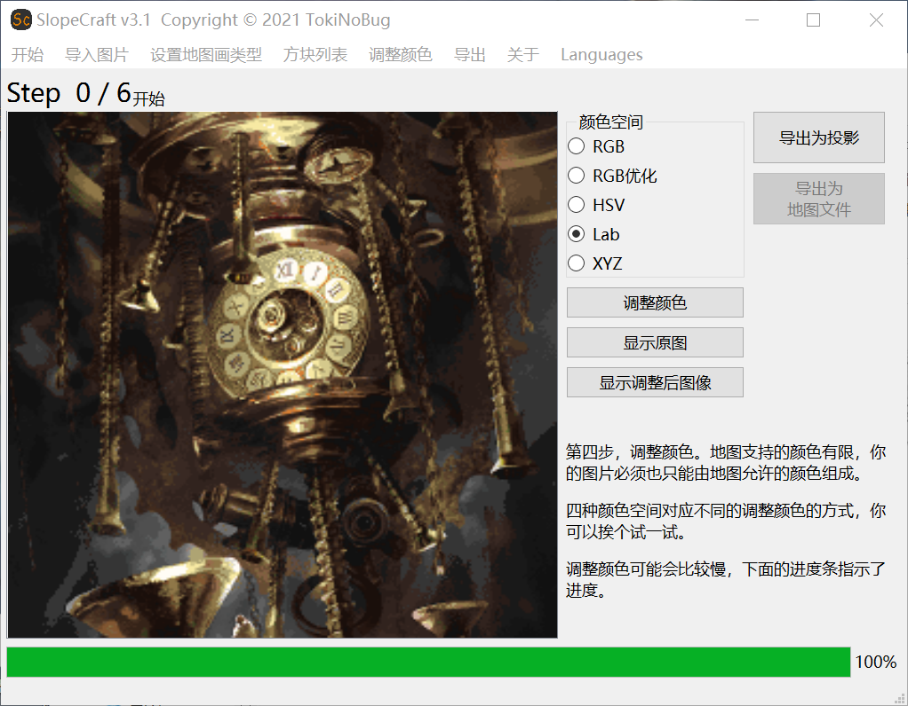

   点击**导出为投影**，跳转到对应的界面。

2. 构建三维结构

   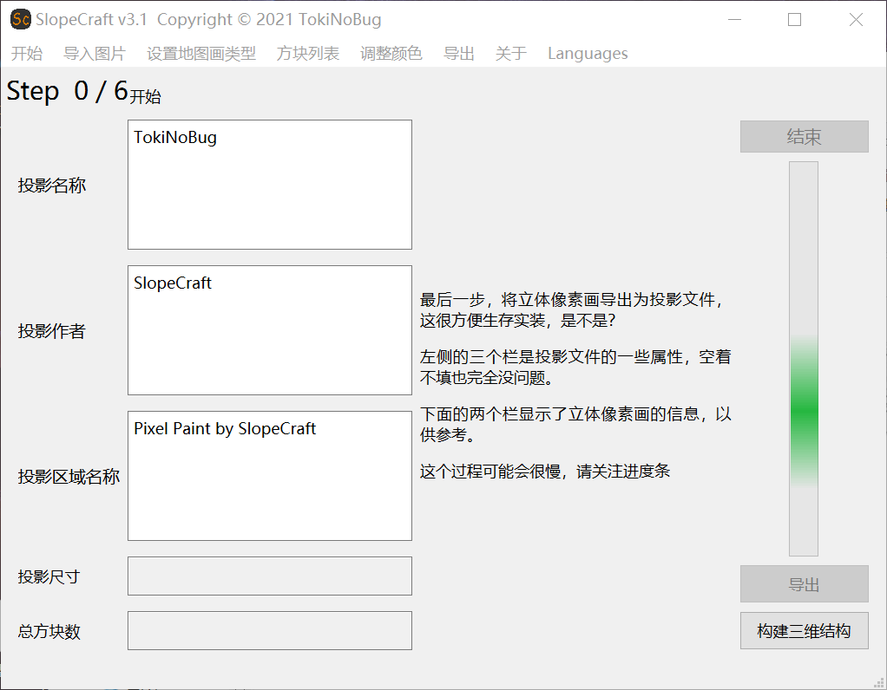

   点击构建三维结构，SlopeCraft会将地图画构建为三维结构，将投影的尺寸和总方块数显示出来。

   **请注意，如果投影y尺寸超过了256，那么千万千万不要继续导出。一个超过限高的投影是没有任何意义的！**

   如果遇到这种情况，有几种方法可能会解决问题：

   - 缩小图片的尺寸
   - 退回到上一步，换一种颜色空间，重新生成地图画
   - 将原图向左或向右旋转90°，重复生成地图画
   - 适当调整图片的色相或饱和度等，重复生成地图画
   - 换一张图片
   - 都不行的话，洗洗睡吧

3. 导出投影文件

   在**投影名称**、**投影作者**和**投影区域**名称三个栏中填入投影文件的信息（**可不填**）（**投影区域名称不要含有中文**），点击**导出**按钮。

   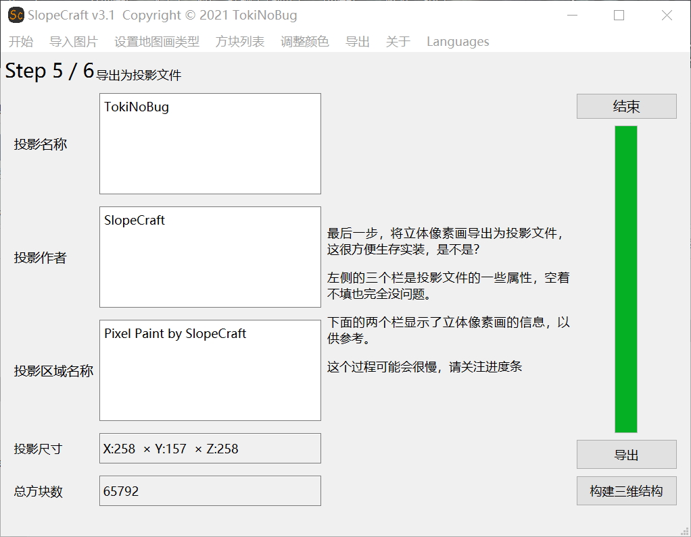

4. 将投影喂给投影mod

   点击**结束**，跳转到最后一页。

   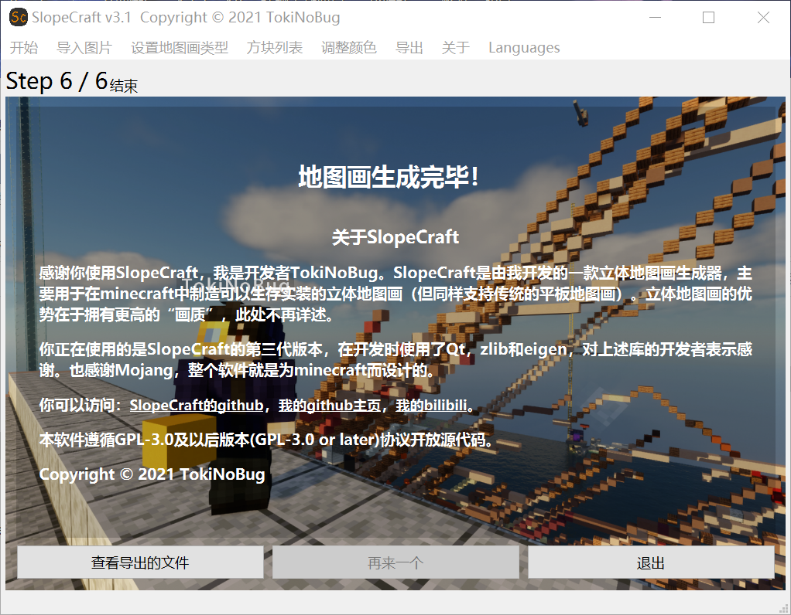

   点击**查看导出的文件**，它会帮你直接在文件夹中显示刚刚生成的投影文件。点击**退出**，退出程序。

   

   接下来，将导出的投影文件移动到.minecraft/schematic文件夹下。然后打开Minecraft，进入存档/服务器，在你想要创建地图画的地方导入这个投影。

   放置投影的时候请注意，**投影原点的x和z坐标必须为-65+k×128，其中k为任意整数**。y坐标则任意。如(63,62,-65)。只有这样，**地图画才能与地图的网格对齐**。

   然后开始实装这个投影，或者直接粘贴原理图。

   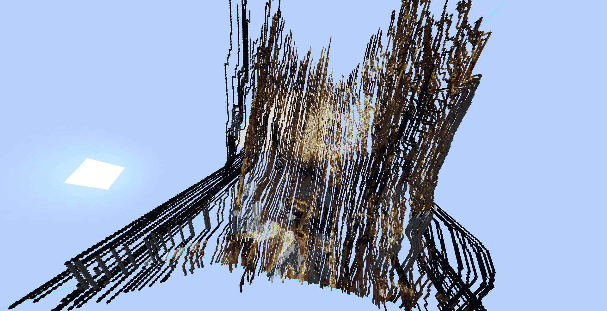

   完成之后，在地图内部创建新的地图。每个地图都应当是无缩放的，每个像素点对应一个方块。

   如果是一个2×2地图的地图画，那么你应当创建2×2，即4个地图。

   如果你的游戏版本是1.14及以上，那么最好在制图台内用玻璃片将地图锁住。

   
   
   将它们按次序摆在物品展示框内，大功告成。

   

### 导出为地图文件

1. 在调整颜色完成之后，**导出为地图文件**的按钮亮起。
   
   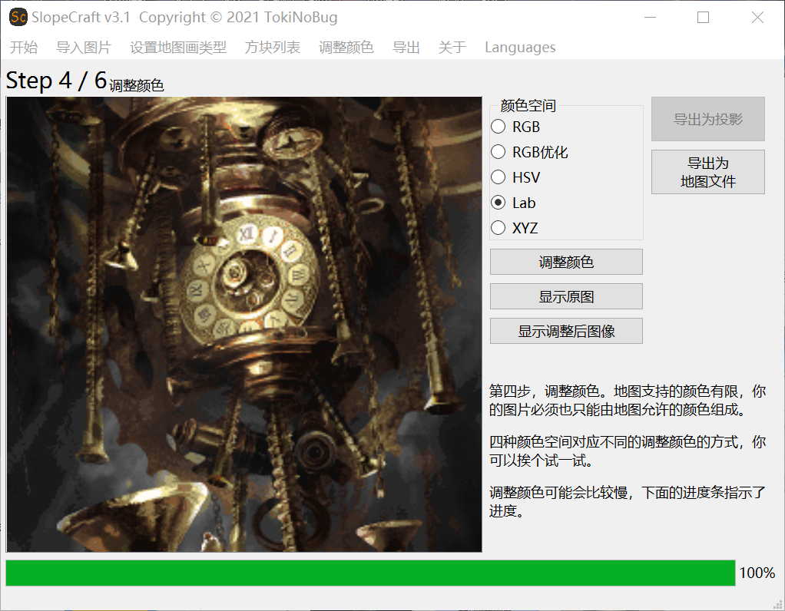

   点击**导出为地图文件**，跳转到对应的界面。

   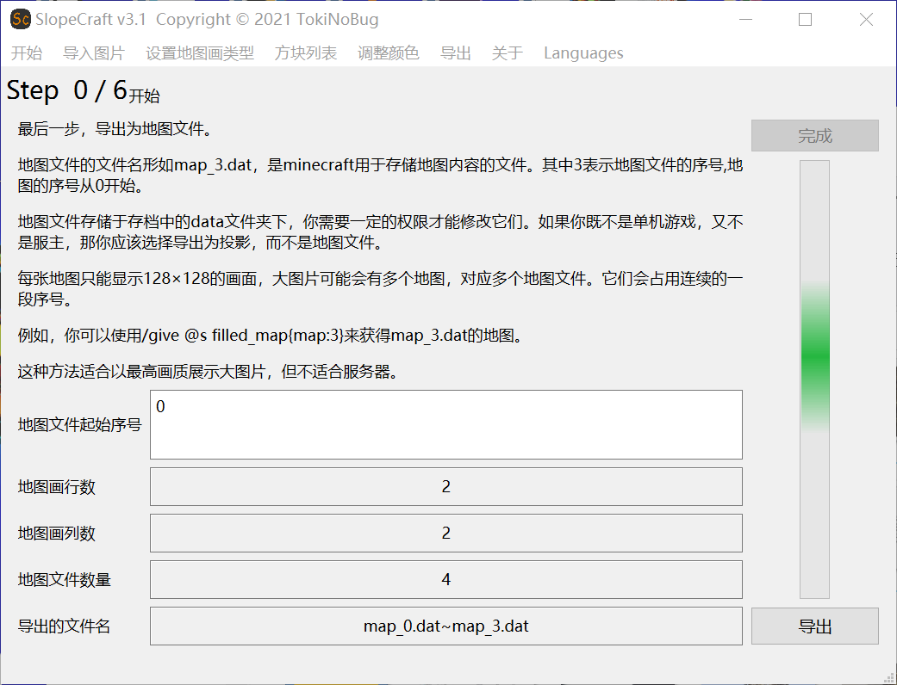

   这个页面显示了地图画对应地图的行数、列数、文件数量和将要导出的地图文件的文件名。

2. 设置地图文件的初始序号

   地图文件的文件名形如map_i.dat，其中i是大于等于0的整数，如map_3.dat。**i就是这个地图文件的序号。序号实际上是地图文件的唯一标识符**。正常情况下，我们生成的地图文件不应该覆盖掉无关的地图文件，所以设置初始序号需多加注意。

   在游戏中按下F3+H可以查看物品的详细信息，**包括地图物品的Id，也就是对应的地图文件的序号**。下图中显示的地图物品对应名为map_6.dat的地图文件。

   

   - 如果你想通过/give命令来获得地图：

     起始序号可以随意设置，只要不覆盖掉无关的地图。
     - 在1.12，使用 `/give @s filled_map 1 i` 来获得序号为i的地图。
     - 在1.13+，使用 `/give @s filled_map{map:i}` 来获得序号为i的地图。

    - 如果你不想使用命令，只替换地图文件：
      1. 先创建与地图画对应的`n`个地图，n就是SlopeCraft显示的地图文件数量，在本例中是4。
      2. 在游戏中按下<kbd>F3</kbd>+<kbd>H</kbd>，查看地图文件对应的序号。这些地图对应的序号应当是 `a`~`(a+n-1)` ，共n个。
      3. 关闭游戏，在SlopeCraft的**地图文件起始序号**栏中填入`a`的值。
      4. 点击导出，选中存档下的data文件夹。SlopeCraft将会替换掉这`n`个地图文件。
      5. 关闭SlopeCraft，打开游戏，这`n`个地图应当已经被成功的替换为地图画。
      6. 如果你担心输错地图文件序号，导致无关的地图被覆盖掉，你可以先新建一个临时的文件夹，在导出时选择这个临时文件夹。确认地图序号无误后，再复制黏贴替换掉你要替换的地图文件。

## 例子

在本教程的例子中，分别导出了一个投影（Example.litematic）和四个地图文件（在MapDataFiles文件夹中）。它们都是nbt格式的文件，可供参考。